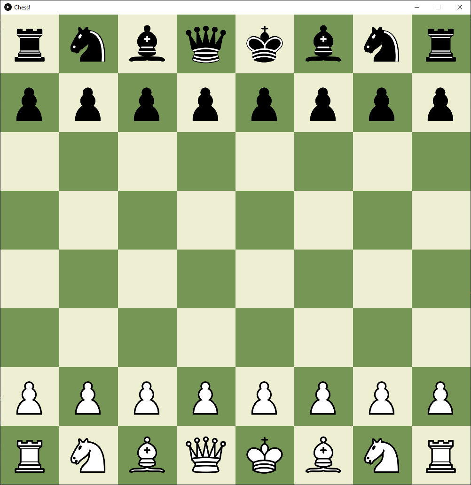
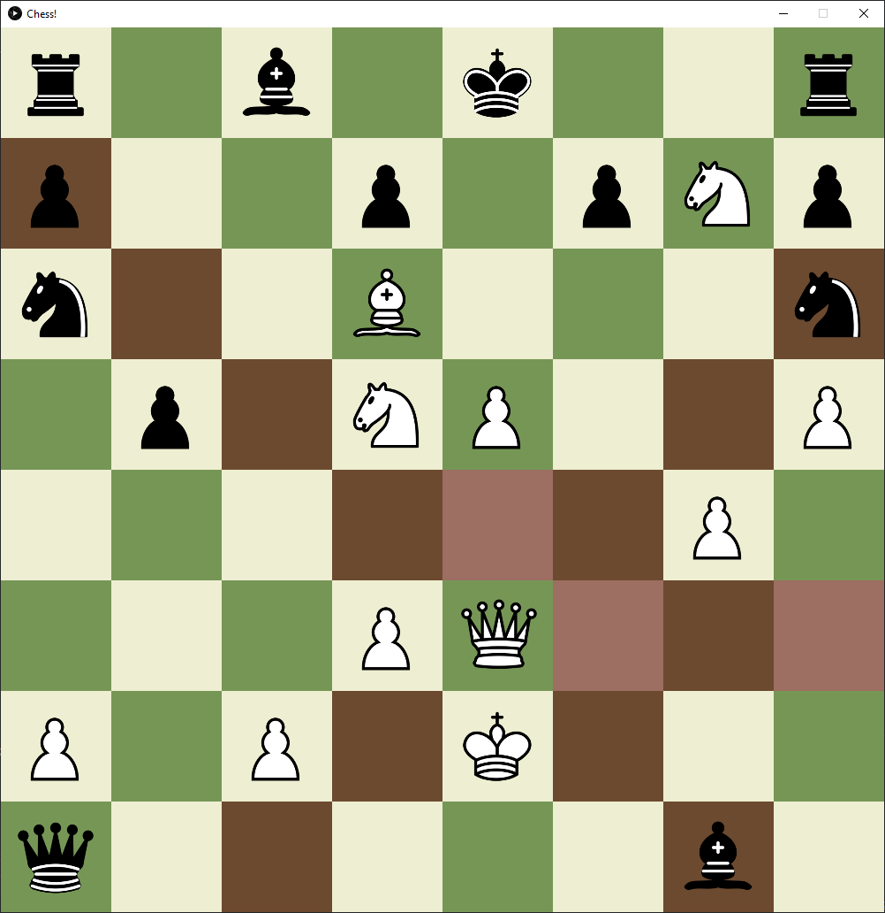

# Chess Clone

## Table of Contents

- [Overview](#overview)
- [Built With](#built-with)
- [Features](#features)
- [Acknowledgements](#acknowledgements)

## Overview

A basic clone of the famous board game Chess. Take turns with a friend playing it out to see who is the better player.
 

### Built With

JAVA using the [Processing](https://processing.org/) library for graphics

## Features

- Piece movement
- Turn swapping
- Highlighting possible movesets
- Legal castling
- Piece capturing
- View [changelog](./changelog.txt)

## Future Features
- Check move restrictions
- En Passant
- Piece promotion
- Standard and generalized piece implementation to allow for modding
- Move history
- Load and save position
- AI Opponent(s)

## Acknowledgements

[The Coding Train](https://www.youtube.com/channel/UCvjgXvBlbQiydffZU7m1_aw) on YouTube. His amazing videos are how I learned to use the Processing and P5.js libraries
